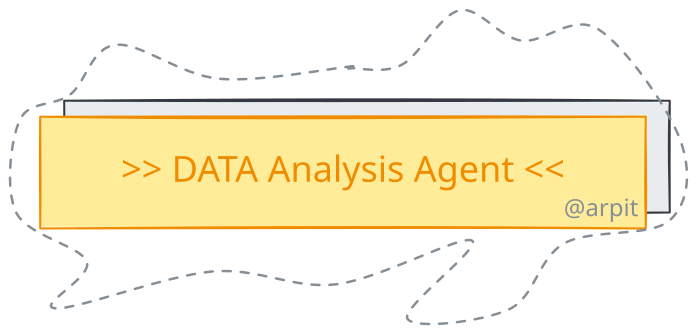

<div align="center">

<picture>
  <source media="(prefers-color-scheme: dark)" srcset="docs/assets/banner-dark.svg">
  <source media="(prefers-color-scheme: light)" srcset="docs/assets/banner-light.svg">
  
</picture>

# Data Analysis Agent

**Chat with your CSV.** Ask a question in plain English. The agent profiles your
data, asks for clarification when needed, writes and runs the analysis code, and
hands back clear, data-grounded insights.

</div>

---

## What it does

- 📊 **Upload a CSV, ask a question.** No SQL or pandas required.
- 🤔 **Asks smart clarifying questions** when your request is ambiguous.
- 🧑‍💻 **Writes and executes analysis code** for you, then double-checks its own work.
- 💡 **Returns insights, caveats, and charts**, not just raw numbers.
- 🖥️ **CLI or web UI**, with a live view of the agent's reasoning.

## Quickstart

**Prerequisites:** Python 3.13+ and an Azure AI Foundry API key.

```bash
# 1. Install
pip install -r requirements.txt        # or: uv sync

# 2. Configure
cp .env.example .env                    # then edit .env and set AZURE_AI_API_KEY

# 3. Ask a question
python src/agent.py --csv tests/data/sales.csv \
  --query "Which region has the highest total order_value?"
```

Prefer a UI? Launch the web app:

```bash
streamlit run app/streamlit_app.py      # http://localhost:8501
```

Or run it in a container:

```bash
docker compose up --build               # http://localhost:8501
```

## How it works (at a glance)

A small team of specialist agents, coordinated by a planner, running a
`reason → plan → act → observe → respond` loop:

```
profiler → planner → ┬─ clarifier  (ask questions)
                     ├─ codegen    (write + run code, self-critique) ⟲
                     └─ insight     (summarize findings)
```

📖 **Want the full picture?** See the [Architecture deep-dive](docs/architecture.md).

## Opinionated choices

This project makes a few deliberate choices to stay simple and fast. All of them
are swappable. See [Design Decisions](wikis/design-decisions.md) for the full
rationale and trade-offs.

| Area | Choice |
| --- | --- |
| Agent framework | **LangGraph + LangChain** |
| LLM provider | **Azure AI Foundry** (any OpenAI-compatible endpoint works) |
| Memory / persistence | **SQLite** checkpointer (per conversation thread) |
| Code execution | **In-process sandbox** with guardrails ⚠️ *not* for untrusted input |
| Dependencies | **uv** (with a `requirements.txt` fallback) |

## Usage tips

```bash
# Let the agent ask clarifying questions first, then resume on the same thread:
python src/agent.py --csv <file.csv> --query "Show me the best performance."
python src/agent.py --csv <file.csv> --query "Show me the best performance." \
  --thread-id <printed-id> --clarifications "Total order_value by region."

# Skip clarifying questions and see the full JSON reasoning trace:
python src/agent.py --csv <file.csv> --query "..." --no-clarify --json-trace
```

Configuration (model, temperature, timeouts, guardrail limits) is set via `.env`.
See the [full reference](docs/architecture.md#configuration-reference).

## Evaluation

```bash
python src/evaluate.py --scenarios tests/scenarios.json --out eval_results.json
```

Runs representative scenarios and scores each output against expected results.
See the [Agent Run Report](docs/agent_run_report.md) for a sample run and results.

## Documentation

| Doc | What's inside |
| --- | --- |
| [Architecture deep-dive](docs/architecture.md) | Agent loop, tools, techniques, config, project layout |
| [Design Decisions](wikis/design-decisions.md) | Why each choice was made + trade-offs |
| [Agent Run Report](docs/agent_run_report.md) | Sample trace, clarification flow, evaluation results |

## Features

Multi-agent orchestration · conversation memory · streaming responses ·
Streamlit UI · Docker deployment · structured (Pydantic) outputs · retries,
timeouts & guardrails · full reasoning trace.
