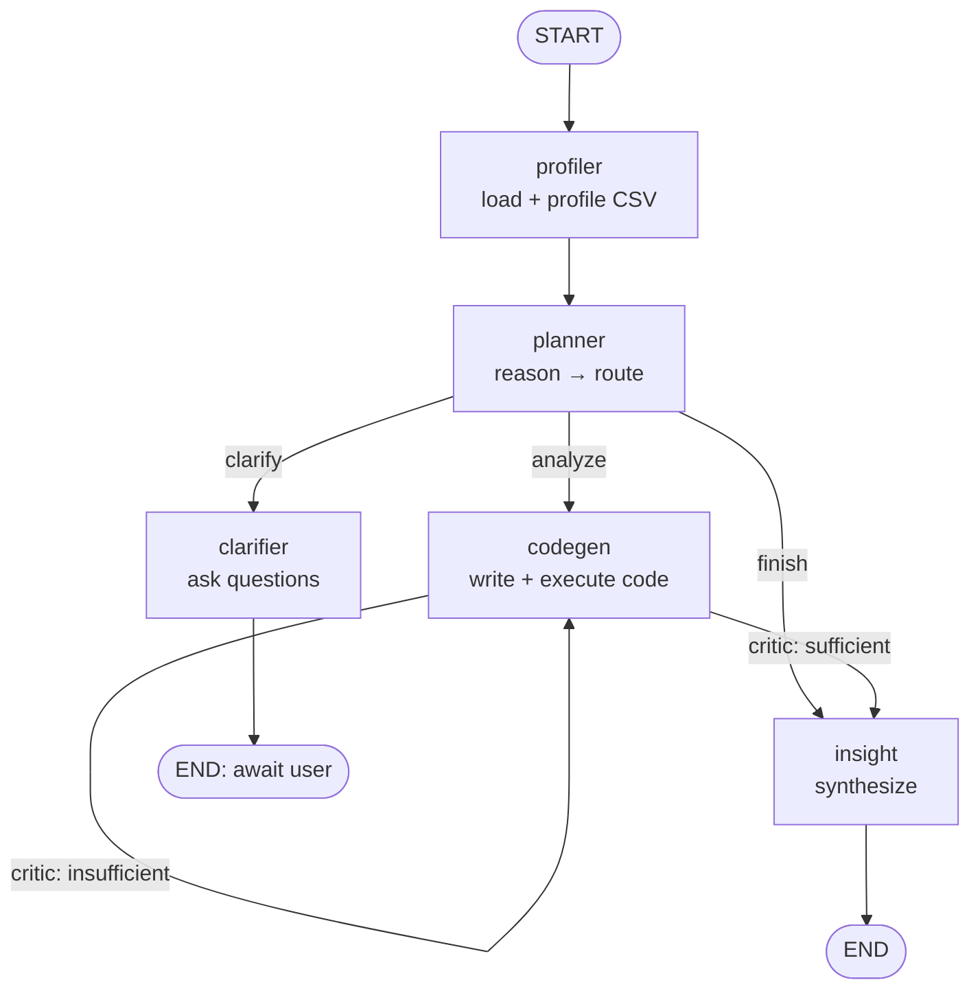

# Data Analysis Agent

An **agentic AI** application that accepts a CSV, asks clarifying questions when
a request is ambiguous, **generates analysis code, executes it in a sandbox, and
returns data-grounded insights**. Built with **LangGraph + LangChain** on an
Azure AI Foundry (OpenAI-compatible) endpoint.

> Domain: *Data Analysis agent* (from the assignment's domain options).

## Why this design

Data analysis is a natural fit for an agent loop: the "right" analysis is often
under-specified, code must be **written and executed** (a real tool call), and
results must be **critiqued** before being trusted. This project models that as
a small team of specialist agents coordinated by a planner, so each concern
(routing, clarification, code, synthesis) has a focused prompt and is
independently testable.

## Architecture

Multi-agent **LangGraph** state machine implementing
`reason → plan → act → observe → respond`, with a **Planner** delegating to
specialists and a **self-reflection** (critic) loop around code execution.



**Agents / tools**

| Component | Role |
| --- | --- |
| `profiler` | Tool: loads + profiles the CSV (shape, dtypes, nulls, summary). |
| `planner` | Reasons and routes to clarify / analyze / finish. |
| `clarifier` | Asks up to 3 targeted clarifying questions. |
| `codegen` | Generates pandas/matplotlib code, runs it via the **execution tool**, then self-critiques. |
| `insight` | Synthesizes final insights + caveats from executed output. |

Two real tool/function calls are used: **CSV profiling** and **sandboxed code
execution**.

## Advanced techniques demonstrated

- **Multi-agent collaboration** — planner delegates to specialists.
- **Self-reflection / self-critique** — a critic judges each analysis and can
  trigger another attempt.
- **Chain-of-thought** prompting in the planner and few-shot examples for code
  generation.
- **Structured output** — every agent hand-off is a typed Pydantic model.

## Robustness & guardrails

- LLM calls wrapped with **retries (tenacity), timeouts, and fallbacks**.
- **Input validation** on the CSV (existence, size limit, parse errors, empty).
- **Token-budget guardrail** truncates oversized prompts.
- **Code guardrails**: an AST scan blocks dangerous imports from a denylist,
  plus a wall-clock execution timeout. (See `wikis/` for the sandbox tradeoff.)
- **Full reasoning trace**: every step is logged and captured as JSON.

## Project structure

```
src/
  agent.py                 # CLI entrypoint (assignment spec)
  evaluate.py              # evaluation runner (assignment spec)
  data_analysis_agent/
    config.py  llm.py  logging_utils.py
    schemas.py  state.py  memory.py  graph.py  runner.py  cli.py  evaluation.py
    prompts/               # system prompts + few-shot
    tools/                 # csv_tools.py, code_exec.py
    agents/                # planner, clarifier, codegen, insight
app/streamlit_app.py       # Streamlit UI (bonus)
tests/scenarios.json       # evaluation scenarios + sample CSV
wikis/                     # design decisions & rationale
docs/agent_run_report.md   # architecture + sample trace + eval results
Dockerfile, docker-compose.yml
```

## Setup

Requires Python 3.13+.

```bash
pip install -r requirements.txt
cp .env.example .env        # then edit .env and set AZURE_AI_API_KEY
```

(Or with [uv](https://docs.astral.sh/uv/): `uv sync`.)

### Configuration (`.env`)

| Variable | Purpose | Default |
| --- | --- | --- |
| `AZURE_AI_API_KEY` | **Required** API key | — |
| `DAA_LLM_BASE_URL` | OpenAI-compatible endpoint | Azure Foundry `.../models` |
| `DAA_LLM_MODEL` | Model name | `gpt-5.4` |
| `DAA_LLM_TEMPERATURE` | Sampling temperature | `0.1` |
| `DAA_LLM_TIMEOUT` / `DAA_LLM_MAX_RETRIES` | Resilience | `60` / `3` |
| `DAA_MAX_INPUT_TOKENS` | Prompt token budget | `100000` |
| `DAA_CODE_TIMEOUT` | Generated-code timeout (s) | `30` |

## Run

```bash
# One-shot analysis (auto-proceed past clarifications)
python src/agent.py --csv tests/data/sales.csv \
  --query "Which region has the highest total order_value?" --no-clarify

# Let the agent ask clarifying questions, then resume on the same thread
python src/agent.py --csv tests/data/sales.csv --query "Show me the best performance."
python src/agent.py --csv tests/data/sales.csv --query "Show me the best performance." \
  --thread-id <printed-thread-id> --clarifications "Total order_value by region."

# Show the full JSON reasoning trace
python src/agent.py --csv tests/data/sales.csv --query "..." --no-clarify --json-trace
```

### Streamlit UI (bonus)

```bash
streamlit run app/streamlit_app.py
```

### Docker (bonus)

```bash
docker compose up --build          # serves the UI on http://localhost:8501
```

## Evaluation

```bash
python src/evaluate.py --scenarios tests/scenarios.json --out eval_results.json
```

Runs 5 representative scenarios (top region, averages by segment, best-selling
category, monthly trend, and an ambiguous query that *should* trigger
clarification) and scores each output against expected keywords/behaviour. See
`docs/agent_run_report.md` for a sample run and results.

## Bonus features

- ✅ Multi-agent orchestration (planner → specialists)
- ✅ Memory / conversation persistence (SQLite checkpointer per `thread_id`)
- ✅ Streaming responses (CLI + UI stream each agent step)
- ✅ Containerized deployment (Dockerfile + docker-compose)
- ✅ Simple UI (Streamlit)