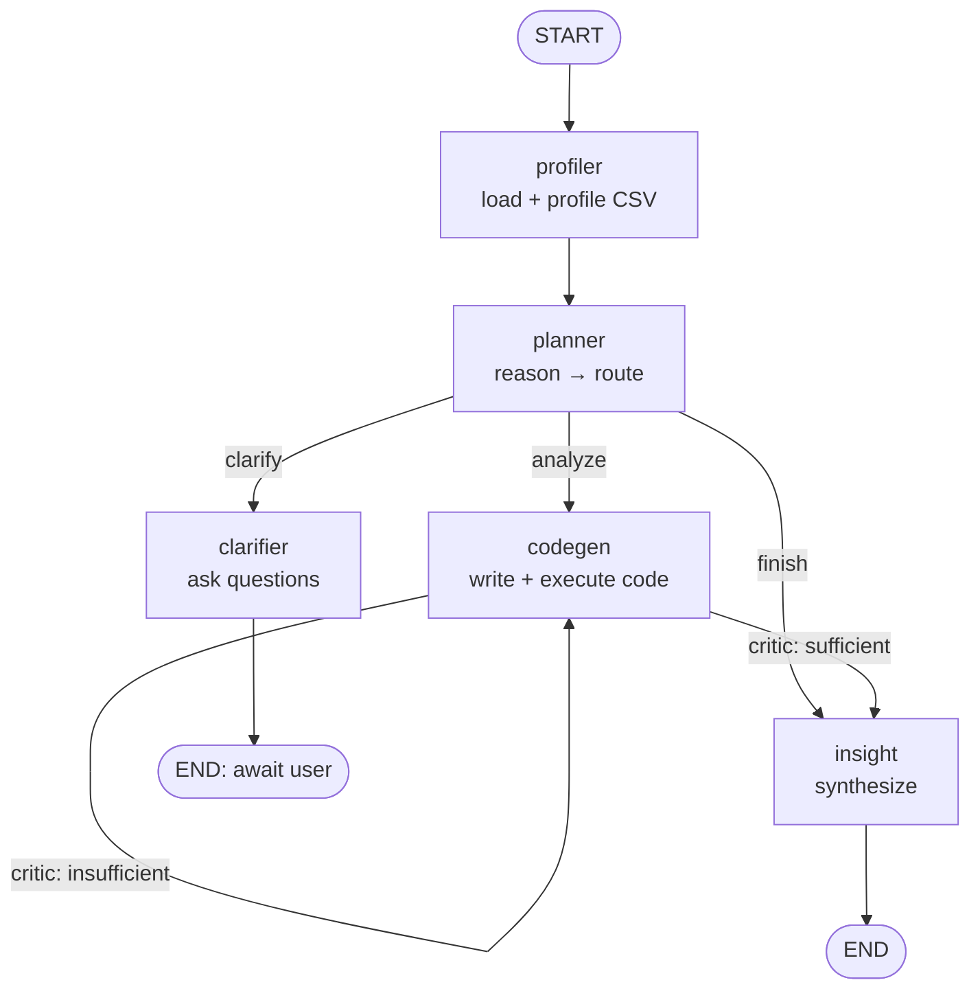

# Agent Run Report — Data Analysis Agent

This report documents the architecture, a full annotated agent trace, evaluation
results, and a summary of design decisions and trade-offs.

## 1. Architecture

Multi-agent LangGraph state machine implementing
`reason → plan → act → observe → respond`:



- **profiler** — tool call: loads + profiles the CSV.
- **planner** — chain-of-thought routing (clarify / analyze / finish).
- **clarifier** — asks targeted clarifying questions and pauses.
- **codegen** — generates + executes pandas code (tool call), then self-critiques.
- **insight** — synthesizes final, data-grounded insights.

## 2. Sample full trace (reasoning chain + tool calls + final output)

**Command**

```bash
python src/agent.py --csv tests/data/sales.csv \
  --query "What is the average order_value per customer_segment?" \
  --no-clarify --json-trace
```

**Streamed steps**

```
[ observe] profiler: loaded and profiled CSV
[    plan] planner: next_action=analyze
[     act] codegen: attempt 1: generated and executed code
[ observe] executor: ok
[  reason] critic: sufficient=True, retry=False
[ respond] insight: synthesized 4 insight(s)
```

**Planner reasoning (chain-of-thought)**

> "The question is specific and directly answerable from the provided columns.
> We should compute the mean of order_value grouped by customer_segment."

**Generated code (tool call: sandboxed execution)**

```python
avg_order_value = (
    df.groupby('customer_segment', dropna=False)['order_value']
      .mean().sort_values(ascending=False)
)
print("Average order_value per customer_segment:")
print(avg_order_value)
summary_parts = [f"{seg}: {val:.2f}" for seg, val in avg_order_value.items()]
result = "Average order_value per customer_segment -> " + "; ".join(summary_parts) + "."
```

**Observed output**

```
Corporate         1096.142308
Consumer           404.982000
Small Business     232.142857
```

**Critic (self-reflection):** `is_sufficient=True` → no retry.

**Final output**

```
## Insights
- Corporate customers have the highest average order_value at 1096.14.
- Consumer customers average 404.98 per order.
- Small Business customers have the lowest average order_value at 232.14.
- Corporate average is ~2.7x Consumer and ~4.7x Small Business.

## Caveats
- Averages only; no order counts or vari/outlier measures provided.
- Total revenue contribution by segment not shown.

## Summary
Average order_value differs substantially by customer segment. Corporate leads
at 1096.14, vs 404.98 (Consumer) and 232.14 (Small Business).
```

## 3. Clarification path (ambiguous query)

**Command**

```bash
python src/agent.py --csv tests/data/sales.csv --query "Show me the best performance."
```

The planner routes to `clarify`; the agent pauses and asks:

```
? What do you mean by "best performance" — highest total order_value, highest
  average order value, highest quantity sold, or something else?
? Which dimension: region, category, customer_segment, specific orders, or overall?
? Full dataset or a particular time period based on order_date?
```

Resuming with `--thread-id <id> --clarifications "..."` restores context from
memory and proceeds to analysis — demonstrating **conversation persistence**.

## 4. Test scenarios & evaluation

Defined in `tests/scenarios.json` (run: `python src/evaluate.py`):

| Scenario | What it checks | Expected |
| --- | --- | --- |
| `top_region_by_revenue` | Grouped sum + argmax | mentions "North", total by region |
| `avg_order_value_by_segment` | Grouped mean | mentions "Corporate", averages |
| `best_selling_category_by_quantity` | Grouped sum of quantity | mentions "Office Supplies" |
| `monthly_revenue_trend` | Date-based comparison | mentions Jan vs Feb |
| `ambiguous_needs_clarification` | Guard behaviour | agent asks clarifying questions |

Scoring is transparent: fraction of expected keywords present, substring checks,
and correct clarify behaviour; a scenario passes at score ≥ its threshold.

**Result of a live run** (`gpt-5.4`):

```
=== Evaluation Report ===
  [PASS] top_region_by_revenue (score=1.0)
  [PASS] avg_order_value_by_segment (score=1.0)
  [PASS] best_selling_category_by_quantity (score=1.0)
  [PASS] monthly_revenue_trend (score=1.0)
  [PASS] ambiguous_needs_clarification (score=1.0)

5/5 scenarios passed (pass_rate=1.0)
```

> Scenario runs require a valid `AZURE_AI_API_KEY`. Reproduce with
> `python src/evaluate.py --scenarios tests/scenarios.json --out eval_results.json`.

## 5. Design decisions & trade-offs (summary)

- **LangGraph + LangChain** for an explicit, inspectable agent loop and free
  persistence/streaming.
- **Azure AI Foundry `ChatOpenAI`** reusing the verified reference config.
- **Simple `exec` sandbox** with AST/import guardrails + timeout — fast to build;
  explicitly **not** a security boundary (swap for subprocess/Docker for
  untrusted input). See `wikis/design-decisions.md`.
- **Pydantic structured output** for reliable agent hand-offs.
- **Bounded self-critique loop** (≤3 attempts) for guaranteed termination.

Full rationale: [`wikis/design-decisions.md`](../wikis/design-decisions.md).
