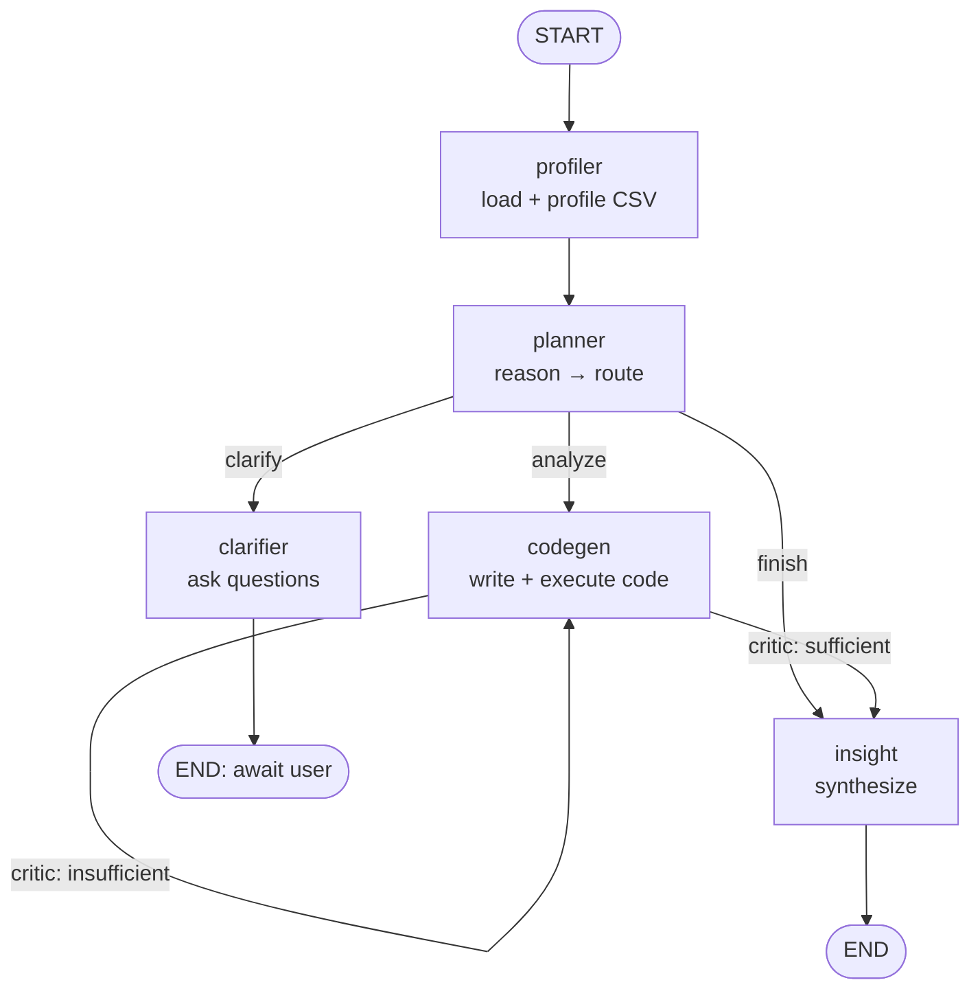

# Architecture & Design Deep-Dive

This document holds the detailed design rationale for the Data Analysis Agent.
For a quick start, see the [README](../README.md). For a sample run and
evaluation results, see the [Agent Run Report](agent_run_report.md). For the
"why we chose X" write-ups, see [Design Decisions](../wikis/design-decisions.md).

## Why an agent for data analysis

Data analysis is a natural fit for an agent loop: the "right" analysis is often
under-specified, code must be **written and executed** (a real tool call), and
results must be **critiqued** before being trusted. This project models that as
a small team of specialist agents coordinated by a planner, so each concern
(routing, clarification, code, synthesis) has a focused prompt and is
independently testable.

## The agent loop

A multi-agent **LangGraph** state machine implementing
`reason → plan → act → observe → respond`, with a **planner** delegating to
specialists and a **self-reflection** (critic) loop around code execution.



## Agents and tools

| Component | Role |
| --- | --- |
| `profiler` | Tool: loads + profiles the CSV (shape, dtypes, nulls, summary). |
| `planner` | Reasons and routes to clarify / analyze / finish. |
| `clarifier` | Asks up to 3 targeted clarifying questions. |
| `codegen` | Generates pandas/matplotlib code, runs it via the **execution tool**, then self-critiques. |
| `insight` | Synthesizes final insights + caveats from executed output. |

Two real tool/function calls are used: **CSV profiling** and **sandboxed code
execution**.

## Advanced techniques demonstrated

- **Multi-agent collaboration** — planner delegates to specialists.
- **Self-reflection / self-critique** — a critic judges each analysis and can
  trigger another attempt (bounded to 3 attempts).
- **Chain-of-thought** prompting in the planner and few-shot examples for code
  generation.
- **Structured output** — every agent hand-off is a typed Pydantic model.

## Robustness & guardrails

- LLM calls wrapped with **retries (tenacity), timeouts, and fallbacks**.
- **Input validation** on the CSV (existence, size limit, parse errors, empty).
- **Token-budget guardrail** truncates oversized prompts.
- **Code guardrails**: an AST scan blocks dangerous imports from a denylist,
  plus a wall-clock execution timeout.
- **Full reasoning trace**: every step is logged and captured as JSON.

## Project structure

```
src/
  agent.py                 # CLI entrypoint (assignment spec)
  evaluate.py              # evaluation runner (assignment spec)
  data_analysis_agent/
    config.py  llm.py  logging_utils.py
    schemas.py  state.py  memory.py  graph.py  runner.py  cli.py  evaluation.py
    prompts/               # system prompts + few-shot
    tools/                 # csv_tools.py, code_exec.py
    agents/                # planner, clarifier, codegen, insight
app/streamlit_app.py       # Streamlit UI
tests/scenarios.json       # evaluation scenarios + sample CSV
wikis/                     # design decisions & rationale
docs/                      # architecture, run report, assets
Dockerfile, docker-compose.yml
```

## Configuration reference

All configuration is externalized to environment variables / `.env`:

| Variable | Purpose | Default |
| --- | --- | --- |
| `AZURE_AI_API_KEY` | **Required** API key | — |
| `DAA_LLM_BASE_URL` | OpenAI-compatible endpoint | Azure Foundry `.../models` |
| `DAA_LLM_MODEL` | Model name | `gpt-5.4` |
| `DAA_LLM_TEMPERATURE` | Sampling temperature | `0.1` |
| `DAA_LLM_TIMEOUT` / `DAA_LLM_MAX_RETRIES` | Resilience | `60` / `3` |
| `DAA_MAX_INPUT_TOKENS` | Prompt token budget | `100000` |
| `DAA_CODE_TIMEOUT` | Generated-code timeout (s) | `30` |
| `DAA_MEMORY_DB` | SQLite memory checkpointer path | `.agent_memory.sqlite3` |
| `DAA_ARTIFACTS_DIR` | Where generated plots are written | `artifacts` |

## Opinionated choices (and how to change them)

This project makes some deliberate, opinionated choices for speed and clarity.
Each is swappable — see [Design Decisions](../wikis/design-decisions.md) for the
full rationale and trade-offs.

| Area | Choice | Why | How to change |
| --- | --- | --- | --- |
| Agent framework | **LangGraph + LangChain** | Explicit, inspectable state machine; free persistence + streaming | Rewrite `graph.py` / `agents/` on another framework |
| LLM provider | **Azure AI Foundry** via `ChatOpenAI` | Reuses a verified-working config | Point `DAA_LLM_BASE_URL` / `DAA_LLM_MODEL` at any OpenAI-compatible endpoint |
| Memory store | **SQLite** checkpointer | Zero-setup, file-based persistence per `thread_id` | Swap the checkpointer in `memory.py` (e.g. Postgres) |
| Code sandbox | **In-process `exec`** + AST denylist + timeout | Fastest to build for trusted, self-authored code | Replace `tools/code_exec.py` with subprocess/Docker isolation |
| Structured output | **Pydantic** models | Reliable, typed agent hand-offs | Edit `schemas.py` |
| Package/deps | **uv** (with `requirements.txt` fallback) | Fast, reproducible installs | Use plain `pip install -r requirements.txt` |

> ⚠️ **Security note:** the code sandbox uses in-process `exec` and is **not** a
> security boundary against adversarial code. It is intended for a trusted,
> single-user context. For untrusted input, switch to subprocess/Docker
> isolation (the `execute_code(code, df)` interface is designed for this swap).
